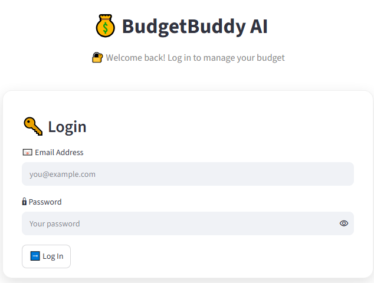
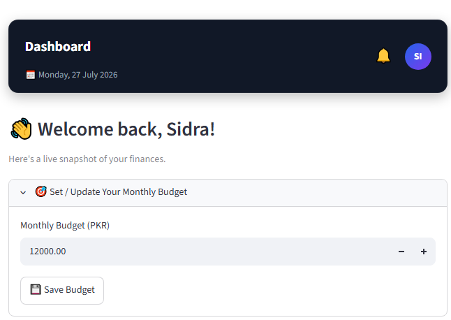

# BudgetBuddy AI

BudgetBuddy AI is an AI-powered personal finance and expense management web application designed for university students. Built with Python and Streamlit, the application enables users to track daily expenditures, allocate and adjust monthly budgets, inspect financial analytics through interactive visualizations, export formal monthly PDF reports, and receive personalized financial coaching via high-performance Groq Large Language Models (LLMs).

Live Application: https://budgetbuddyaigit-6kzawsvdhrdc7jo6mszwhu.streamlit.app/

GitHub Repository: https://github.com/SidraPervaiz1122/BudgetBuddyAI

---

## Problem Statement

University students frequently face difficulties managing limited monthly allowances, balancing recurring living costs against discretionary spending, and identifying where savings can be achieved. Conventional personal finance software is often overly complex, burdened with enterprise accounting overhead, or devoid of intelligent, context-aware financial guidance.

BudgetBuddy AI addresses these challenges with a focused, student-tailored platform that combines expense logging, automated budget utilization tracking, real-time analytics, and an AI advisor grounded directly in the student's actual transaction history.

---

## Key Features

### User Authentication and Account Security
- User Registration: Client-side validation ensuring valid email formatting via regular expressions, minimum password length requirements (at least 8 characters), and password confirmation matching.
- Secure Password Storage: Passwords are encrypted using salted bcrypt hashes prior to storage in SQLite.
- Brute-Force Protection: Automatic rate limiting tracks consecutive failed login attempts per email address. Exceeding 5 failed attempts locks authentication for 10 minutes to prevent credential stuffing attacks.
- Session Management: Guard rails across all private application pages prevent unauthorized guest access. Authenticated sessions store user identifiers and names in Streamlit session state.
- Secure Session Termination: The logout mechanism completely flushes session state variables, clears cached user records from memory, and redirects to the login view.

### Multi-Step Password Reset (Forgot Password Flow)
- Step 1 - Verification Request: The user submits their registered email. If an associated account exists, a cryptographically random 6-digit numeric one-time password (OTP) is generated, hashed using bcrypt, and stored with a 10-minute expiration timestamp in the database. The plain OTP is dispatched to the user's inbox via SMTP.
- Step 2 - Code Verification: The user enters the 6-digit code. The system checks expiration, locks out verification after 5 incorrect guesses, and provides distinct feedback without disclosing account enumeration details. Users can resend a code or switch emails.
- Step 3 - Password Reset: Upon successful verification, the user provides and confirms a new password (minimum 8 characters). The database updates the password hash and clears the reset token record.
- Universal SMTP Mailer: Outgoing reset emails support automatic host and port detection for standard providers (Gmail, Outlook/Office365, Hotmail, Live, MSN, Yahoo, iCloud, and Zoho) with STARTTLS encryption.

### Monthly Budget Management
- Configurable Monthly Targets: Users can define and update their target budget for the calendar month.
- Dual-Mode Budget Controls:
  - Set Exact Amount: Overwrite or initialize the monthly budget total.
  - Add Funds: Top up the existing budget with additional funds without resetting the accumulated total.
- Utilization Tracking: Real-time calculation of total monthly expenses, remaining balance, and savings percentage.
- Budget Utilization Gauge: A visual radial gauge with distinct warning tiers:
  - 0% to 70%: Normal spending pace (green).
  - 70% to 90%: Caution tier (yellow).
  - 90% to 100%+: Near or exceeding limit (red threshold line at 100%). The gauge axis dynamically expands past 100% if overspending occurs.

### Expense Tracking and Transaction Management
- Structured Expense Logging: Records include amount in Pakistani Rupee (PKR), expense category, date (restricted to current date or earlier), and description.
- Predefined Student Categories:
  - Food
  - Transport
  - Education
  - Shopping
  - Entertainment
  - Bills
  - Health
  - Other
- Inline Expense Editing: Users can modify existing transaction amounts, categories, dates, and descriptions directly within the transaction list.
- Safe Record Deletion: Two-step confirmation mechanism ("Delete" followed by "Confirm") to prevent unintended data loss.
- Filtering and Search: Live filtering by expense category and substring searching across transaction descriptions.
- Data Isolation: All expense operations enforce strict user ownership constraints (`user_id`), ensuring complete tenant separation.

### Financial Analytics and Data Visualization
- Dedicated Analytics Dashboard: Deeper analytical views distinct from the main dashboard cards to eliminate duplicate charts.
- Key Performance Indicators (KPIs):
  - Total historical expenditure.
  - Average daily spending across the active logging period.
  - Highest single expense record (with category and date metadata).
  - Lowest single expense record (with category and date metadata).
- Interactive Visualizations:
  - Monthly Spending Trend: Spline line chart tracking spending across calendar months.
  - Top Spending Categories: Horizontal bar chart ranked by expenditure volume with color gradients.
  - Daily Spending Trend: Area chart illustrating day-to-day spending patterns.
  - Category Breakdown Donut Chart: Proportional expense distribution with hover percentages on the dashboard.
- Interactive Data Table: Tabular presentation featuring search, category filtering, column-based sorting, and dynamic container height scaling according to row count.

### AI Financial Advisor and Chat Assistant
- Groq AI Integration: Powered by Groq's high-speed inference engine using the `llama-3.3-70b-versatile` model, with automatic fallback to `llama-3.1-8b-instant`.
- Data-Grounded Advisory: The AI Advisor constructs a prompt containing the user's current budget, total spending, category breakdown, and recent transactions, generating actionable suggestions.
- Context-Aware Chat Assistant: A persistent conversational interface retaining message history throughout the user session. Every query is evaluated against the student's real-time financial metrics.
- Scoped Financial System Prompt: The AI models operate under strict behavioral instructions focused on student budgeting, practical savings, concise guidance (under 150 words), and strict prohibition of risky investment advice.
- Resilient Error Handling: Gracefully manages API authentication issues, rate limits (HTTP 429), timeouts, and model availability with user-friendly alerts, preventing raw stack traces from reaching the UI.

### Monthly Reports and PDF Generation
- Historical Period Selection: Reports can be generated for any month across the current and preceding three calendar years.
- Live Financial Synthesis: On-screen display of total spent, highest spending category, lowest spending category, transaction counts, and formatted category breakdown tables.
- Optional AI Report Summary: On-demand AI narrative analyzing monthly financial performance, with model provenance indicators.
- Formatted PDF Export: Generates downloadable, publication-ready PDF documents using ReportLab. Reports feature header branding, user metadata, summary metrics tables, category expenditure breakdowns, and optional AI commentary.

### User Interface and Application Layout
- Light/Dark Layout Balance: A deep navy sidebar paired with a clean, high-contrast content area inspired by modern SaaS interfaces.
- Custom Header Bar (Navbar): Displays page titles, a time-aware greeting adjusted for Pakistan Standard Time (Asia/Karachi, UTC+5), the current calendar date, and user initials avatar badges.
- Custom Sidebar: Displays application branding, user initials, active route pill highlights, an overview widget showing current budget and remaining balance (color-coded for positive or negative status), and session termination.
- Network-Independent UI Controls: Custom CSS fallback shapes replace web-font ligatures for navigation controls, ensuring proper visual rendering even in offline or firewalled environments.
- Mobile and Tablet Responsiveness: Fluid CSS media queries and flexbox containers ensure usability across mobile viewports, tablets, and desktop displays.

### Performance and Caching Architecture
- Cache Strategy: Expense lists and budget queries utilize `@st.cache_data` with a 30-second time-to-live (TTL).
- Immediate Invalidation: Mutations (adding, updating, or deleting expenses; setting or topping up budgets) immediately execute `clear_data_cache()`, preventing stale reads without creating redundant database load.

---

## Technology Stack

| Layer | Component / Library | Purpose |
| :--- | :--- | :--- |
| Application Framework | Streamlit (>= 1.38.0) | Multi-page routing, layout rendering, state handling |
| Programming Language | Python (>= 3.10) | Core backend logic and data processing |
| Database Engine | SQLite 3 (`expenses.db`) | Relational persistence, foreign key enforcement, migrations |
| Security and Cryptography | bcrypt (>= 4.0.0) | Salted password hashing, reset code hash verification |
| Data Processing | Pandas (>= 2.0.0) | Aggregations, grouping, table sorting, trend analytics |
| Data Visualization | Plotly (>= 5.20.0) | Interactive charts (pie, line, bar, area, gauge) |
| Artificial Intelligence | Groq Python SDK (>= 0.4.0) | Fast LLM inference (`llama-3.3-70b-versatile`, `llama-3.1-8b-instant`) |
| Document Export | ReportLab (>= 4.0.0) | Programmatic, formatted monthly PDF report creation |
| Email Delivery | Python `smtplib` / `email.mime` | Automated dispatch of 6-digit password reset verification codes |

---

## Database Architecture

The application manages an embedded SQLite database stored at `expenses.db`. The schema is created automatically on initial run via `create_tables()` in `database/db.py`, and existing schemas are updated via `_migrate_schema()`.

```
+-------------------------------------------------------------+
|                            users                            |
+--------------------+------------------+---------------------+
| id                 | INTEGER          | PRIMARY KEY AUTOINC |
| name               | TEXT             | NOT NULL            |
| email              | TEXT             | NOT NULL UNIQUE     |
| password           | TEXT             | NOT NULL (bcrypt)   |
| monthly_budget     | REAL             | NOT NULL DEFAULT 0  |
+--------------------+------------------+---------------------+
                                 |
                                 | 1:N (ON DELETE CASCADE)
                                 v
+-------------------------------------------------------------+
|                           expenses                          |
+--------------------+------------------+---------------------+
| id                 | INTEGER          | PRIMARY KEY AUTOINC |
| user_id            | INTEGER          | FOREIGN KEY (users) |
| amount             | REAL             | NOT NULL            |
| category           | TEXT             | NOT NULL            |
| description        | TEXT             |                     |
| date               | TEXT             | NOT NULL (YYYY-MM)  |
| created_at         | TEXT             | NOT NULL Timestamp  |
+--------------------+------------------+---------------------+

+-------------------------------------------------------------+
|                       password_resets                       |
+--------------------+------------------+---------------------+
| email              | TEXT             | PRIMARY KEY         |
| code_hash          | TEXT             | NOT NULL (bcrypt)   |
| expires_at         | TEXT             | NOT NULL Timestamp  |
| attempts           | INTEGER          | NOT NULL DEFAULT 0  |
+--------------------+------------------+---------------------+

+-------------------------------------------------------------+
|                        login_attempts                       |
+--------------------+------------------+---------------------+
| email              | TEXT             | PRIMARY KEY         |
| failed_attempts    | INTEGER          | NOT NULL DEFAULT 0  |
| locked_until       | TEXT             | Lockout Expiry ISO  |
+--------------------+------------------+---------------------+
```

---

## Project Structure

```
BudgetBuddyAI/
|-- .gitignore                     # Git ignore rules (secrets, venv, sqlite db)
|-- .streamlit/
|   |-- config.toml                # Streamlit UI theme configuration
|   |-- secrets.toml               # Local secrets (API keys, SMTP) - not tracked
|-- app.py                         # Application entry point and page routing
|-- assets/
|   |-- background.png             # UI branding asset
|   |-- logo.png                   # Application logo asset
|-- components/
|   |-- cards.py                   # Reusable dashboard metric cards
|   |-- navbar.py                  # Header bar with time-aware greeting
|   |-- sidebar.py                 # Primary navigation and user summary sidebar
|-- database/
|   |-- db.py                      # SQLite database operations and authentication
|-- images/
|   |-- ai_advisor.png             # AI Advisor interface screenshot
|   |-- ai_chat.png                # AI Chat assistant screenshot
|   |-- analytics.png              # Analytics page screenshot
|   |-- dashboard.png              # Main dashboard screenshot
|   |-- login.png                  # Login screen screenshot
|   |-- report.png                 # Reports and PDF generation screenshot
|-- pages/
|   |-- add_expense.py             # Expense creation, editing, and deletion
|   |-- ai_advisor.py              # Financial advice module powered by Groq
|   |-- ai_chat.py                 # Conversational financial assistant
|   |-- analytics.py               # In-depth financial trends and data table
|   |-- dashboard.py               # Central financial overview and gauge chart
|   |-- forgot_password.py         # Multi-step OTP password recovery flow
|   |-- login.py                   # User login with brute-force lockout
|   |-- reports.py                 # Monthly report builder and PDF generator
|   |-- signup.py                  # User registration page
|-- requirements.txt               # Pinned Python package dependencies
|-- style.css                      # Global CSS stylesheet
|-- utils/
|   |-- helpers.py                 # Math, cached loaders, Groq client, SMTP mailer
|-- README.md                      # Technical project documentation
```

---

## Installation and Setup

### 1. Prerequisites
- Python 3.10 or higher installed on your system.
- Git version control.
- A free Groq API key from https://console.groq.com.
- (Optional) An email account with SMTP app credentials for password reset delivery.

### 2. Clone the Repository
```bash
git clone https://github.com/SidraPervaiz1122/BudgetBuddyAI.git
cd BudgetBuddyAI
```

### 3. Set Up a Virtual Environment

On Windows (PowerShell):
```powershell
python -m venv venv
.\venv\Scripts\Activate.ps1
```

On Windows (Command Prompt):
```cmd
python -m venv venv
.\venv\Scripts\activate.bat
```

On macOS / Linux:
```bash
python3 -m venv venv
source venv/bin/activate
```

### 4. Install Dependencies
```bash
pip install -r requirements.txt
```

---

## Configuration and Secrets Setup

Streamlit manages sensitive runtime credentials through the `.streamlit/secrets.toml` file.

Create the file `.streamlit/secrets.toml` in your project root:

```toml
# Required: Groq API key for AI Advisor, AI Chat, and Monthly Report summaries
GROQ_API_KEY = "your_groq_api_key_here"

# Optional: Required only if you want to enable email-based password reset
EMAIL_SENDER = "your_email@gmail.com"
EMAIL_PASSWORD = "your_16_character_app_password"

# Optional: Custom SMTP server override (automatically inferred for standard providers)
# SMTP_HOST = "smtp.gmail.com"
# SMTP_PORT = 587
```

### Critical Security Guidelines
- The `.streamlit/secrets.toml` file is explicitly listed in `.gitignore` to prevent secret leakage.
- Never commit, push, or share your `secrets.toml` file or any real API keys, passwords, or tokens.
- For Gmail users: `EMAIL_PASSWORD` must be a 16-character Google App Password generated from your Google Account settings, not your account login password.
- If email credentials are not configured, the rest of the application (including expense tracking, budget management, analytics, and Groq AI features) remains fully functional.

---

## Running the Application

Execute the following command from the project root:

```bash
streamlit run app.py
```

The application will launch locally at `http://localhost:8501`.

Note: The database file (`expenses.db`) is automatically initialized on the first launch. No manual database setup or SQL migration script is required.

---

## Application Screenshots

### User Authentication


### Dashboard Overview


### Analytics and Visualizations


### AI Financial Advisor


### AI Chat Assistant


### Monthly Reports and PDF Export


---

## Security Considerations

1. Key Protection: API credentials and email secrets are stored exclusively server-side in `.streamlit/secrets.toml` and accessed via `st.secrets` or environment variables.
2. Database Exclusion: `expenses.db` is excluded from git tracking via `.gitignore` to protect personal financial transactions and hashed credentials.
3. Password Hashing: Uses bcrypt with per-user salts, protecting against rainbow table attacks.
4. Brute-Force Rate Limiting: The `login_attempts` table tracks failed logins and initiates a 10-minute lockout after 5 consecutive failures.
5. One-Time Passwords: Password reset tokens are stored as bcrypt hashes, expire after 10 minutes, and are restricted to 5 verification attempts.
6. Tenant Isolation: All database write and query operations require valid `user_id` validation to enforce user isolation.
7. Error Sanitization: AI API errors, database exceptions, and SMTP connection failures are caught and surfaced as friendly alerts, preventing internal stack traces or configuration leaks.

---

## Current Limitations

- Single Currency: Financial calculations and displays currently use Pakistani Rupee (PKR).
- Local Database: Uses SQLite for local persistence. Multi-instance horizontal scaling would require migrating to an external PostgreSQL database.
- SMTP Requirement: The forgot-password verification code feature requires active SMTP credentials in `secrets.toml` to send emails.
- Groq Rate Limits: AI requests adhere to free-tier Groq API rate limits (tokens per minute and requests per day).
- PDF Dependency: PDF report export relies on the ReportLab library specified in `requirements.txt`.

---

## Author

Sidra Pervaiz  
BS Computer & Information Sciences  
Pakistan Institute of Engineering and Applied Sciences (PIEAS)  
GitHub: https://github.com/SidraPervaiz1122

---

## License

This project is developed for educational purposes as the Final AI App Project.